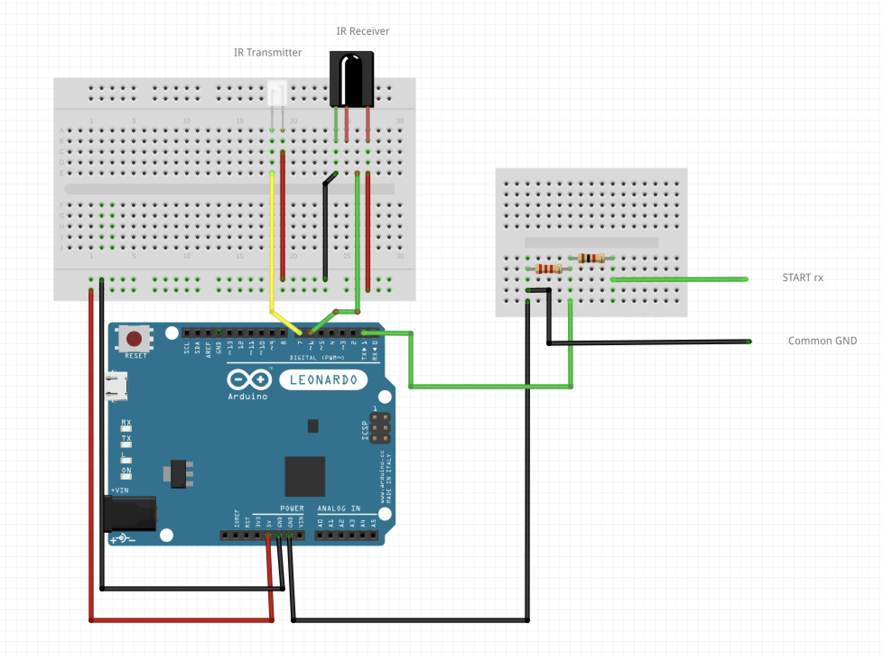
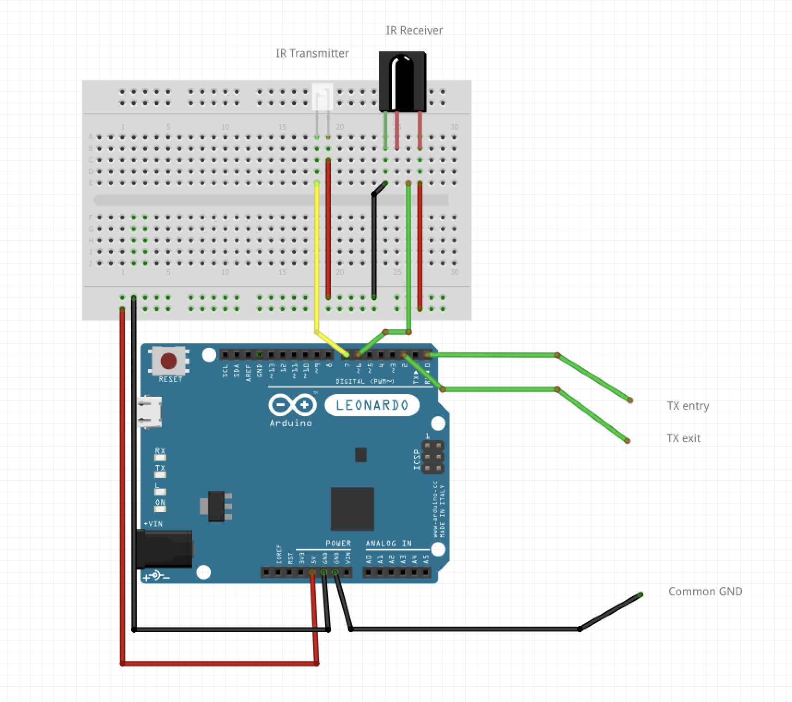
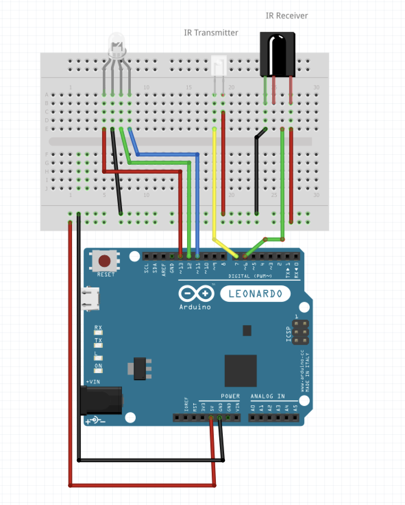

# Lap timing

## Table of contents
- [Lap timing](#lap-timing)
  - [Table of contents](#table-of-contents)
  - [Project description](#project-description)
  - [Requirements](#requirements)
    - [Hardware](#hardware)
    - [Software](#software)
  - [Hardware configuration](#hardware-configuration)
    - [Pit entry/exit](#pit-entryexit)
    - [Start](#start)
    - [Car](#car)
  - [Project layout](#project-layout)
  - [Run instructions](#run-instructions)
  - [Links](#links)
  - [Team members and roles](#team-members-and-roles)

## Project description
This project aims to detect cars passing through a road acquiring the laptime, and also to signal when a car enters or exits the pit. The signaling between the cars and the "ground boards" is done using infrared light. The data is collected by a main board and sent to a backend that will save it on Firebase, as well as send a notification on Telegram.

## Requirements

### Hardware
> Assume *n* as the number of cars, for the demonstration project *n*=2

Boards required:
- 2 Arduino of any kind
- 1 Esp8266 (NodeMCU) or any other wifi module
- 1 Arduino for each car (*n*)
  
Boards used:
- 1 Arduino Leonardo    *[Pit entry]*
- 2 Arduino promicro    *[Pit exit, car]*
- 1 Arduino Nano        *[car]*
- 1 Esp8266 (NodeMCU)   *[Start]*


Passive components:
- 2 1k Ω resistor
- 2 2k Ω resistor
- 3+(*n*) IR transmitter
- 3+(*n*) IR receiver
- *n* rgb leds


### Software

- PlatformIO (for the embedded boards)
- Go (for the backend)
- Firebase account (for the database)
- Protobuf compiler (for the protobuf files) (not required if you use the precompiled files)

## Hardware configuration
### Pit entry/exit
The pit entry and the pit exit boards recive the signal transmitted from the car and send it to the start board (via UART 5v dropped to 3.3v). The pit entry board also sends an IR signal that should be recived by the car to change it's status.


### Start

The start board recives the signal from the pit entry and the pit exit boards (UART 3.3v). It receives the IR signal with the `car_id_code` from the car and sends an univoque code to the car.



### Car
The car constantly transmits his `car_id_code` (univoque for each car) via IR to the various boards, when it reads the codes sent by the different "ground boards" it changes it's status and changes the led color.



## Project layout

```bash
.
├── backend                 #Source code of the backend, written in Go
│   ├── firebase_interface
│   ├── laptiming           #Protobuf files
│   └── secrets
├── embedded                #Source code of the embedded boards, written in C++
│   ├── car
│   │   └── src
│   ├── pit_entry_exit
│   │   ├── proto           #Protobuf files for serial communication
│   │   └── src
│   └── start
│       ├── proto           #Protobuf files for serial communication and HTTP requests to the backend
│       └── src
└── protobuf
```

## Run instructions

Start the backend:
- Insert the secrets in the `backend/secrets` folder (such as the json file for the firebase account)
- Run `go run backend/main.go`

Flash the boards:
- Go to the desired folder inside `embedded` (e.g. `embedded/car`)
- `pio run -e <environment> -t build` (where `<environment>` is the name of the environment in the `platformio.ini` file)
- `pio run -e <environment> -t upload` 

## Links

- [Presentation]()
- [Video]()

## Team members and roles

Team members:
- Piccinin Diego [mat. 217776]
- Pivetta Leonardo [mat. 217395]

Roles:
- **Wiring**: Piccinin Diego;
- **Backend**: Leonardo Pivetta;
- **Embedded code**: both of us, we live together so we built almost everything together.
  - Serial communication: mainly Leonardo Pivetta;
  - IR communication: mainly Diego Piccinin;